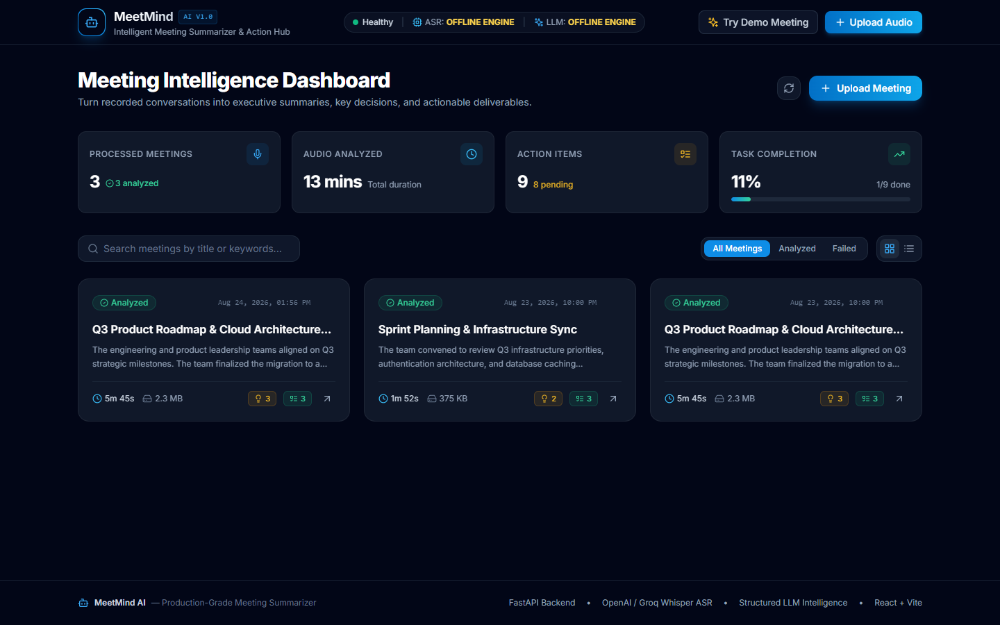
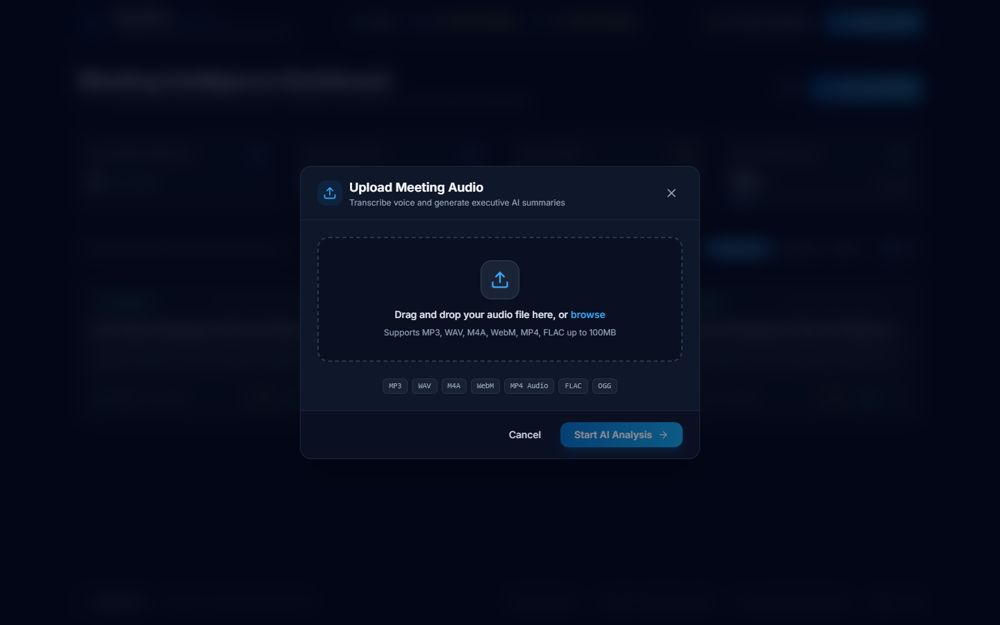
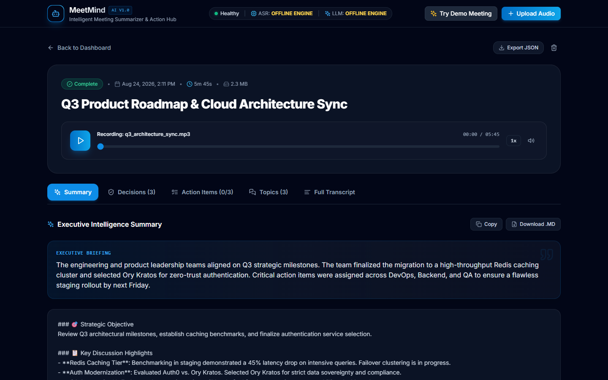
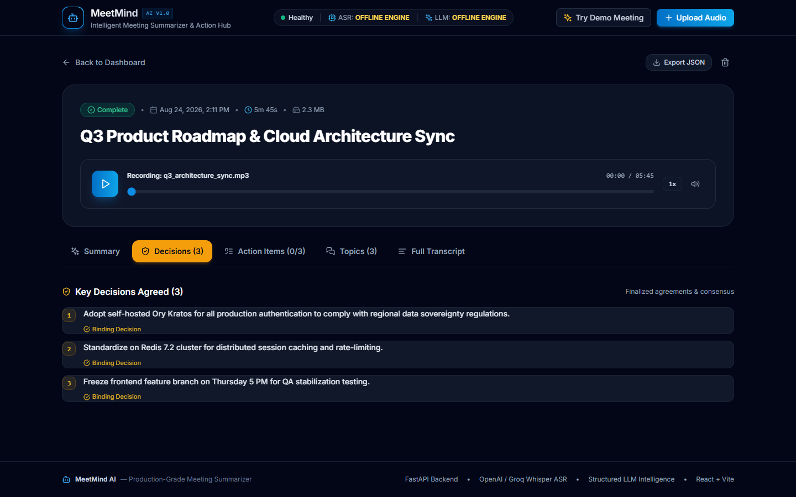
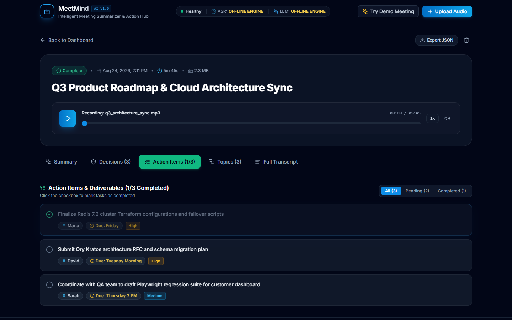
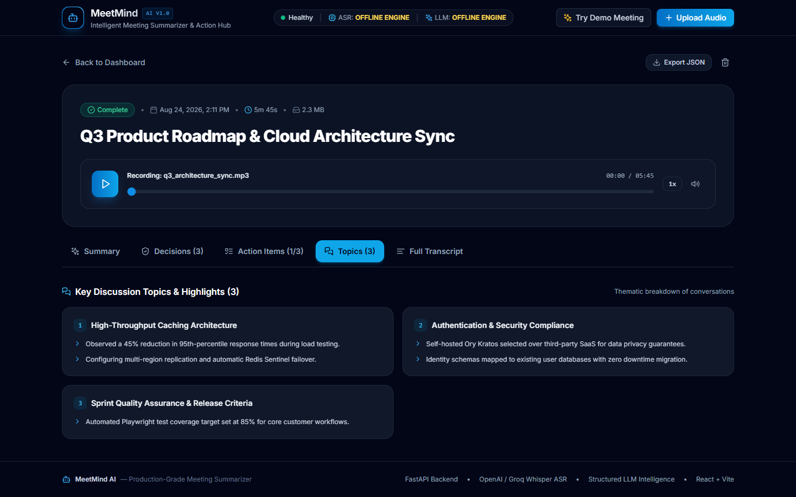
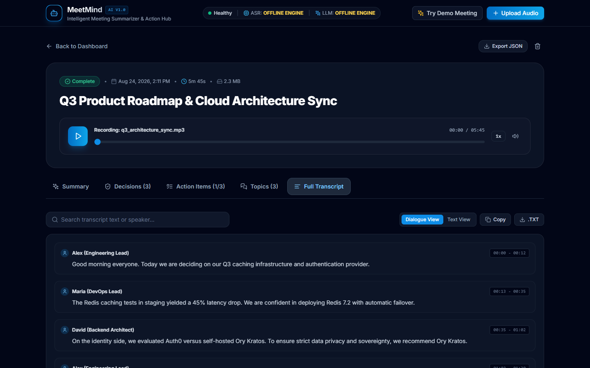

# MeetMind — AI Meeting Summarizer

[](https://fastapi.tiangolo.com)
[](https://reactjs.org)
[](https://tailwindcss.com)
[](https://www.sqlalchemy.org)
[](https://platform.openai.com/docs/guides/speech-to-text)
[](https://opensource.org/licenses/MIT)

**MeetMind** is an end-to-end, developer-grade meeting intelligence platform that transcribes recorded audio conversations, synthesizes structured executive summaries, isolates binding decisions from exploratory discussions, and extracts concrete action items with assignees, deadlines, and completion tracking.

---

## 📸 User Interface & Screenshots

### 1. Meeting Intelligence Dashboard
Overview of all processed meetings, aggregated analytics metrics, and search/filter controls:


### 2. Audio Ingestion & Format Validation
Drag-and-drop audio uploader supporting MP3, WAV, M4A, WebM, MP4, FLAC up to 100MB:


### 3. Executive Intelligence Summary & Web Player
Executive briefing, detailed markdown minutes, and embedded audio player with speed controls:


### 4. Key Decisions & Consensus
Clearly distinguished binding decisions with impact indicators:


### 5. Interactive Action Items & Deliverables Tracker
Action items with assignees, deadlines, priority tags, and real-time completion toggles:


### 6. Thematic Discussion Topics
Structured breakdown of conversation highlights and technical consensus:


### 7. Dialogue Transcript Explorer
Timestamped speaker turns, continuous text toggle, and search filter:


## 🎥 Demo Video & Walkthrough

A complete, high-resolution end-to-end walkthrough video demonstrating:
- Opening the dashboard and reviewing meeting metrics
- Uploading and validating audio files
- Real-time transcription and structured AI summary extraction
- Inspecting executive briefs, key decisions, and discussion highlights
- Interacting with action items and toggling completion status
- Timestamped dialogue searching and transcript exports

<p align="center">
  <video src="docs/meetmind_demo_walkthrough.webm" width="100%" controls="controls" preload="metadata">
    Your browser does not support the video tag.
  </video>
</p>

🎬 **[▶️ Click here to open/download the Demo Video Walkthrough](docs/meetmind_demo_walkthrough.webm)**

*The video recording file is stored directly in the repository at `docs/meetmind_demo_walkthrough.webm` and is ready for offline playback in any browser or media player, as well as uploading to your submission portal.*

---

## 🌟 Key Features

- **Multi-Format Audio Ingestion**: Upload MP3, WAV, M4A, MP4 Audio, WebM, FLAC, and OGG recordings up to 100MB with automated format and size validation.
- **Dual-Engine Whisper ASR**: Supports high-accuracy OpenAI Whisper (`whisper-1`) and ultra-fast Groq Cloud Whisper (`whisper-large-v3`), with automatic offline deterministic fallback for test environments.
- **Engineered LLM Intelligence**: Rigorously prompt-engineered natural language synthesis that guarantees zero hallucination of unmentioned names or deadlines.
- **Key Decisions Isolation**: Explicitly distinguishes between agreed team decisions and conversational suggestions or proposals.
- **Action Item Execution Tracker**: Extracts tasks, assignees (or marks *Unassigned*), deadlines (or marks *null*), priority levels (`LOW`, `MEDIUM`, `HIGH`, `CRITICAL`), with interactive completion status toggles.
- **Dialogue & Segmented Transcripts**: Timestamped speaker segment viewer with instant search filtering, raw text toggle, and one-click export (Markdown, TXT, JSON).
- **Built-In Audio Player**: Embedded waveform and audio player with playback speed adjustment (1x, 1.25x, 1.5x, 2x), timeline seeking, and volume control.
- **Meeting Metrics & Analytics**: Aggregates total meetings, hours of audio transcribed, action item counts, and completion rates.
- **Instant Demo Seeder**: One-click demo meeting generator for evaluators to test the full UI without needing an audio file or active API key.

---

## 🏗️ System Architecture

```
                                  USER (Browser)
                                         │
                   ┌─────────────────────┴─────────────────────┐
                   │                                           │
         React 18 + Vite (SPA)                      Embedded Web Player
         • Dashboard & Analytics                    • Audio Stream & Seek
         • Drag & Drop Uploader                     • Multi-Speed Playback
         • Live Processing Timeline
         • Structured Intelligence Panes
                   │
                   ▼  REST API (JSON & Multipart Audio)
        ┌─────────────────────────────────────────────────────────────┐
        │                 FastAPI Backend (Port 8000)                 │
        │                                                             │
        │  ┌───────────────────────┐       ┌───────────────────────┐  │
        │  │ AudioService          │       │ MeetingService        │  │
        │  │ • Format Validation   │       │ • Pipeline Manager    │  │
        │  │ • Stream Storage      │       │ • CRUD & Metrics      │  │
        │  │ • Duration Metadata   │       │ • Cascade Deletion    │  │
        │  └───────────┬───────────┘       └───────────┬───────────┘  │
        │              │                               │              │
        │              ▼                               ▼              │
        │  ┌───────────────────────┐       ┌───────────────────────┐  │
        │  │ TranscriptionService  │       │ SummarizationService  │  │
        │  │ • OpenAI Whisper ASR  │       │ • GPT-4o / Llama 3.3  │  │
        │  │ • Groq Whisper-v3     │       │ • JSON Schema Prompt  │  │
        │  │ • Deterministic Mock  │       │ • Action & Decisions  │  │
        │  └───────────────────────┘       └───────────────────────┘  │
        └──────────────────────────────┬──────────────────────────────┘
                                       │
                                       ▼
                   ┌───────────────────────────────────────┐
                   │        Persistence & Storage Layer     │
                   │  • SQLite Database (SQLAlchemy 2.0)   │
                   │  • Audio Storage: storage/audio/      │
                   └───────────────────────────────────────┘
```

---

## 🛠️ Tech Stack

| Layer | Technology | Rationale |
| :--- | :--- | :--- |
| **Backend Framework** | [FastAPI](https://fastapi.tiangolo.com) | Asynchronous, auto-generated OpenAPI documentation, fast JSON serialization. |
| **Validation & Schema** | [Pydantic v2](https://docs.pydantic.dev) | High-speed data validation and strict JSON-schema enforcement for LLM responses. |
| **Database & ORM** | [SQLAlchemy 2.0](https://www.sqlalchemy.org) + [SQLite](https://www.sqlite.org) | Zero-configuration persistence, foreign key relationships, cascade deletions. |
| **Speech Recognition (ASR)** | OpenAI Whisper (`whisper-1`) / Groq (`whisper-large-v3`) | State-of-the-art speech-to-text with timestamped segment accuracy. |
| **LLM Summarization** | OpenAI (`gpt-4o-mini`, `gpt-4o`) / Groq (`llama-3.3-70b`) | Enterprise-grade structured JSON extraction with anti-hallucination prompting. |
| **Frontend Framework** | [React 18](https://react.dev) + [TypeScript](https://www.typescriptlang.org) | Type-safe, component-driven UI architecture with responsive layout. |
| **Build Tool** | [Vite 5](https://vitejs.dev) | Sub-millisecond HMR development server and optimized production bundle. |
| **Styling** | [Tailwind CSS v3](https://tailwindcss.com) + [Lucide React](https://lucide.dev) | SaaS-grade dark theme, glassmorphism cards, and intuitive visual hierarchy. |

---

## 📂 Project Structure

```
MeetMind — AI Meeting Summarizer/
├── docs/
│   ├── meetmind_demo_walkthrough.webm    # Full application walkthrough video recording
│   └── screenshots/                      # High-resolution UI screenshots (01 to 07)
├── backend/
│   ├── app/
│   │   ├── api/
│   │   │   ├── endpoints/
│   │   │   │   ├── health.py             # System health & provider diagnostics
│   │   │   │   └── meetings.py           # Upload, process, list, get, audio, delete
│   │   │   ├── deps.py                   # SQLAlchemy session dependency
│   │   │   └── __init__.py
│   │   ├── core/
│   │   │   ├── config.py                 # Pydantic Settings & environment variables
│   │   │   ├── database.py               # SQLAlchemy engine & session factory
│   │   │   ├── logging.py                # Structured console logging
│   │   │   └── __init__.py
│   │   ├── models/
│   │   │   ├── meeting.py                # Meeting SQLAlchemy model
│   │   │   ├── action_item.py            # ActionItem SQLAlchemy model
│   │   │   └── __init__.py
│   │   ├── prompts/
│   │   │   ├── meeting_prompts.py        # Engineered system & user LLM prompts
│   │   │   └── __init__.py
│   │   ├── schemas/
│   │   │   ├── meeting.py                # Pydantic request/response schemas
│   │   │   └── __init__.py
│   │   ├── services/
│   │   │   ├── audio_service.py          # Audio validation, storage, duration
│   │   │   ├── transcription_service.py  # Pluggable Whisper ASR service
│   │   │   ├── summarization_service.py  # LLM intelligence & JSON extraction
│   │   │   ├── meeting_service.py        # Orchestration pipeline & DB operations
│   │   │   └── __init__.py
│   │   ├── main.py                       # FastAPI application entry point & SPA server
│   │   └── __init__.py
│   ├── sample_data/
│   │   ├── generate_sample_audio.py      # Synthetic audio test generator
│   │   └── sample_meeting.wav            # Sample test audio recording
│   ├── storage/
│   │   └── audio/                        # Secure local audio upload directory
│   ├── tests/
│   │   ├── conftest.py                   # Pytest fixtures & in-memory DB configuration
│   │   ├── test_action_items.py          # Action item toggling & updates
│   │   ├── test_file_validation.py       # Audio format, size limit & empty file tests
│   │   ├── test_health.py                # Health endpoint diagnostics
│   │   ├── test_meeting_workflow.py      # Full upload -> process -> delete lifecycle
│   │   └── test_prompt_parsing.py        # LLM JSON parsing & fallback sanitization
│   ├── .env.example                      # Documented environment variables template
│   ├── pytest.ini                        # Pytest configuration
│   └── requirements.txt                  # Python dependencies
├── frontend/
│   ├── src/
│   │   ├── api/
│   │   │   ├── client.ts                 # Type-safe API client
│   │   │   └── types.ts                  # TypeScript data interfaces
│   │   ├── components/
│   │   │   ├── ActionItemsTable.tsx      # Interactive action item tracker
│   │   │   ├── AudioPlayer.tsx           # Audio player with speed control
│   │   │   ├── DecisionsList.tsx         # Agreed consensus cards
│   │   │   ├── DeleteModal.tsx           # Confirmation modal
│   │   │   ├── DiscussionPoints.tsx      # Thematic conversation highlights
│   │   │   ├── EmptyState.tsx            # Initial dashboard empty state
│   │   │   ├── MeetingCard.tsx           # Dashboard card / list item
│   │   │   ├── Navbar.tsx                # Header with live ASR/LLM status
│   │   │   ├── ProcessingTimeline.tsx    # Multi-stage live progress visualizer
│   │   │   ├── StatsBanner.tsx           # Meeting & action item metrics
│   │   │   ├── SummaryView.tsx           # Executive summary & markdown viewer
│   │   │   ├── TranscriptViewer.tsx      # Dialogue segments & full text search
│   │   │   └── UploadModal.tsx           # Drag-and-drop audio uploader
│   │   ├── pages/
│   │   │   ├── Dashboard.tsx             # Main dashboard with search and filters
│   │   │   └── MeetingDetail.tsx         # Comprehensive results view
│   │   ├── App.tsx                       # Root routing & layout container
│   │   ├── index.css                     # Tailwind CSS directives & custom themes
│   │   └── main.tsx                      # React DOM entry point
│   ├── index.html                        # HTML template with Inter typography
│   ├── package.json                      # Frontend dependencies & build scripts
│   ├── postcss.config.js                 # PostCSS configuration
│   ├── tailwind.config.js                # Tailwind CSS theme configuration
│   ├── tsconfig.json                     # TypeScript compiler configuration
│   └── vite.config.ts                    # Vite bundler configuration & proxy
├── .env.example                          # Root environment template
├── .gitignore                            # Strict exclusion rules (no keys, venv, node_modules)
├── README.md                             # Comprehensive project documentation
└── run.py                                # Single-command local launcher
```

---

## ⚡ Quickstart Guide

### Prerequisites

- **Python**: 3.10 or higher
- **Node.js**: v18.0 or higher (with npm)
- **Git**

---

### Step 1 — Clone the Repository

```bash
git clone https://github.com/Alan321-cell/meetmind-ai-meeting-summarizer.git
cd meetmind-ai-meeting-summarizer
```

---

### Step 2 — Backend Configuration & Setup

1. Navigate to the `backend/` directory:
   ```bash
   cd backend
   ```
2. Create and activate a Python virtual environment:
   ```bash
   # On macOS/Linux:
   python3 -m venv venv
   source venv/bin/activate

   # On Windows (PowerShell):
   python -m venv venv
   .\venv\Scripts\Activate.ps1
   ```
3. Install dependencies:
   ```bash
   pip install -r requirements.txt
   ```
4. Configure your environment variables:
   ```bash
   cp .env.example .env
   ```
   *Note: If no API key is provided, MeetMind automatically operates in deterministic offline mode for zero-key evaluation.*
5. Start the FastAPI backend server:
   ```bash
   uvicorn app.main:app --reload --port 8000
   ```
   *Backend is live at: `http://127.0.0.1:8000` (API Docs: `http://127.0.0.1:8000/docs`)*

---

### Step 3 — Frontend Setup

1. Open a new terminal and navigate to `frontend/`:
   ```bash
   cd frontend
   ```
2. Install frontend dependencies:
   ```bash
   npm install
   ```
3. Start the Vite development server:
   ```bash
   npm run dev
   ```
   *Frontend is live at: `http://localhost:5173`*

---

## ⚙️ Environment Variables

Create `.env` inside the `backend/` directory based on `.env.example`:

| Variable | Type | Default | Description |
| :--- | :--- | :--- | :--- |
| `ENVIRONMENT` | string | `development` | Runtime mode (`development` or `production`). |
| `DATABASE_URL` | string | `sqlite:///./meetmind.db` | SQLAlchemy connection string. |
| `ASR_PROVIDER` | string | `auto` | `auto`, `groq`, `openai`, or `mock`. |
| `LLM_PROVIDER` | string | `auto` | `auto`, `groq`, `openai`, or `mock`. |
| `OPENAI_API_KEY` | string | `""` | Optional OpenAI secret key for Whisper & GPT models. |
| `OPENAI_MODEL` | string | `gpt-4o-mini` | OpenAI LLM model name. |
| `GROQ_API_KEY` | string | `""` | Optional Groq API key for ultra-fast Whisper & Llama 3.3. |
| `GROQ_MODEL` | string | `llama-3.3-70b-versatile`| Groq LLM model name. |
| `MAX_UPLOAD_SIZE_MB`| integer| `100` | Maximum allowable audio upload size in MB. |

---

## 📡 REST API Reference

| Method | Endpoint | Description |
| :--- | :--- | :--- |
| `GET` | `/api/health` | System health, database connectivity, and configured AI providers. |
| `GET` | `/api/meetings/stats` | Aggregate metrics (total meetings, duration, completed tasks). |
| `POST`| `/api/meetings/upload` | Upload meeting audio file (multipart/form-data). |
| `POST`| `/api/meetings/{id}/process` | Trigger transcription (ASR) & AI summarization pipeline. |
| `POST`| `/api/meetings/demo` | Seed an instant pre-analyzed demo meeting for evaluation. |
| `GET` | `/api/meetings` | List meetings with pagination, search, and status filtering. |
| `GET` | `/api/meetings/{id}` | Retrieve complete meeting intelligence, decisions, and action items. |
| `GET` | `/api/meetings/{id}/audio` | Stream or download the uploaded audio file for web playback. |
| `PATCH`| `/api/meetings/{id}/action-items/{item_id}` | Update action item status (`COMPLETED`/`PENDING`), assignee, or deadline. |
| `DELETE`| `/api/meetings/{id}` | Delete meeting record, associated action items, and stored audio file. |

Interactive Swagger documentation is available at: **`http://127.0.0.1:8000/docs`**

---

## 🧪 Running Automated Tests

MeetMind includes a comprehensive automated test suite testing health diagnostics, file validations, LLM JSON parsing, action item management, and the full meeting processing lifecycle using an in-memory SQLite database.

Run the test suite from the `backend/` directory:

```bash
cd backend
pytest -v
```

### Test Coverage Summary:
- `test_health.py`: System health check & provider validation.
- `test_file_validation.py`: Rejection of unsupported extensions, empty files, and valid WAV uploads.
- `test_prompt_parsing.py`: Pydantic validation of clean JSON, markdown-wrapped JSON, and empty transcripts.
- `test_meeting_workflow.py`: End-to-end meeting creation, processing pipeline, list retrieval, stats, and cascade deletion.
- `test_action_items.py`: Action item status toggles and field updates.

---

## 🎬 Demonstration Walkthrough

1. **Launch the Application**: Start the backend (`http://127.0.0.1:8000`) and frontend (`http://localhost:5173`).
2. **Instant Demo**: Click **"Try Demo Meeting"** in the top navbar. MeetMind will instantly load a pre-analyzed engineering sync featuring:
   - Executive Briefing
   - 3 Categorized Discussion Topics
   - 3 Key Decisions
   - 3 Action Items with assignees and deadlines
   - Full Dialogue Transcript with timestamped speaker turns
   - Embedded Audio Player with multi-speed controls
3. **Upload Real Audio**:
   - Click **"Upload Audio"**.
   - Drag and drop any voice recording (`.mp3`, `.wav`, `.m4a`, etc.).
   - Watch the multi-stage live progress visualizer (`Uploading` ➔ `Whisper ASR Transcription` ➔ `LLM Intelligence Extraction` ➔ `Meeting Ready`).
4. **Interact with Results**:
   - Toggle action items as **Completed** to see live completion percentages update.
   - Filter action items by *Pending* or *Completed*.
   - Search the full transcript for specific keywords or speakers.
   - Click **"Copy"** or **"Download .MD"** to export structured meeting minutes.
5. **Delete Meeting**: Click the delete icon and confirm permanent deletion.

---

## 🔒 Security & Best Practices

- **Zero Hardcoded Secrets**: Secrets are read strictly from environment variables.
- **Sanitized Filenames**: Filenames are sanitized with UUID prefixes and regex character stripping to prevent path traversal attacks.
- **Safe Audio Storage**: Uploaded files are isolated within `backend/storage/audio/` and are strictly excluded from git tracking via `.gitignore`.
- **Anti-Hallucination Prompting**: AI prompts explicitly mandate strict factual grounding with null/unassigned fallbacks.
- **Cascading Deletions**: Deleting a meeting removes database records and purges the audio file from the disk.

---

## 📄 Assignment Submission Details

- **Repository**: Public GitHub repository
- **Branch**: `main`
- **Cleanliness**: Excludes all `.env`, `node_modules`, `venv`, `dist`, `__pycache__`, `*.db`, and temporary test artifacts.

---

## 📄 License

This project is licensed under the MIT License.
